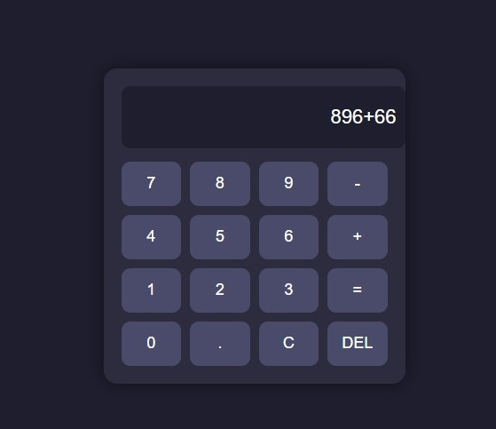
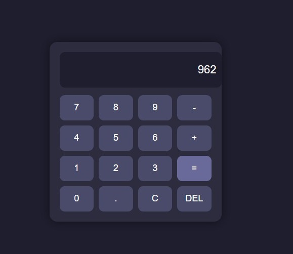

# 🧮 Calculator App

A simple and modern calculator built using HTML, CSS, and JavaScript.
This project performs basic arithmetic operations with a clean and user-friendly interface.

---

## 🌐 Live Demo

👉 https://gungun-cse0090.github.io/calculator/

---

## 📸 Screenshots

---

## 🚀 Features

* ➕ Addition
* ➖ Subtraction
* ✖ Multiplication
* ➗ Division
* 🧹 Clear (C) button
* ⌫ Delete (DEL) button
* 🎨 Clean and modern UI

---

## 🛠️ Technologies Used

* HTML
* CSS
* JavaScript

---

## 📁 Project Structure

calculator/
│── index.html
│── style.css
│── script.js
│── screenshot.png
│── screenshot1.png

----

## 💡 Future Improvements

* Add keyboard support
* Add scientific calculator features
* Add calculation history
* Improve UI animations

---

## 🙌 Author

Made by gungun

---
